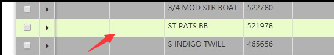
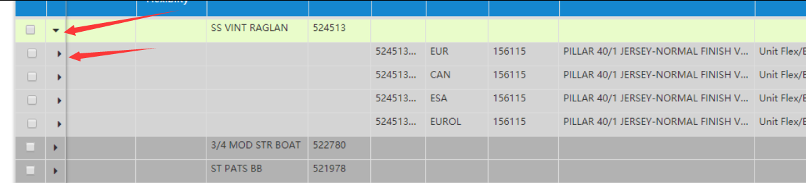
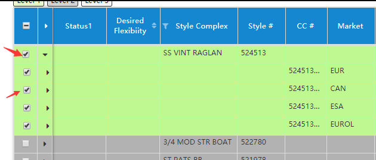
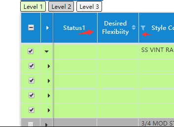
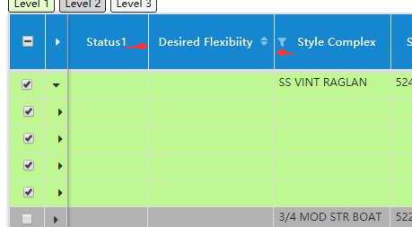
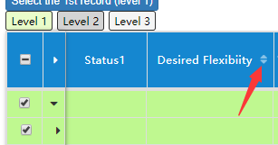
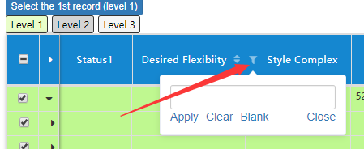
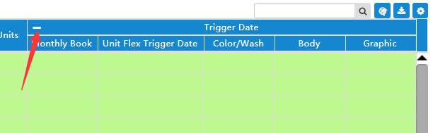

# datatable-demo

> A Vue.js project

## Build Setup

``` bash
# install dependencies
npm install

# serve with hot reload at localhost:8080
npm run dev

# build for production with minification
npm run build

# build for production and view the bundle analyzer report
npm run build --report
```

For a detailed explanation on how things work, check out the [guide](http://vuejs-templates.github.io/webpack/) and [docs for vue-loader](http://vuejs.github.io/vue-loader).

*This text will be italic*
_This will also be italic_


## 鼠标移动到某一行数据高亮
### 在BodyTable.vue里循环数据的<tr>标签内添加@mouseenter="onRowMouseenter(row)" @mouseleave="onRowMouseleave(row)"，
### 再添加
```methods: {
	onRowMouseenter (row) {
        this.$emit('mouseover-on-row', { row })
      },
      onRowMouseleave (row) {
        this.$emit('mouseleave-on-row', { row })
      }
	}
```
### 在Datatable.vue的<body-table>内添加@mouseover-on-row="onRowMouseover"和@mouseleave-on-row="onRowMouseleave"进行监听，
### 再在methods里添加：
```	onRowMouseover ({ row }) {
        this.mouseoverRowId = row.id
      },
      onRowMouseleave ({ row }) {
        this.mouseoverRowId = null
      },
```
### 当鼠标移动到某数据的时候，将那行数据的ID传到方法，执行高亮。





### ~~~~~~~~~~~~~~~~~~~~~~~~~~~~~~~~~~~~~~~~~~~~~~~~~~~~~~~


## 点击打开数据的下一级数据
### 在BodyTable.vue里<td>标签内添加@click="onRowCheckboxClick(row, $event)"，然后再methods里添加：
```	onRowCheckboxClick (row, event) {
        if (event.target) {
          $(event.target).blur()
        }
        this.$emit('row-checkbox-click', { row })
      }
```
### 在Datatable.vue的<body-table>内添加@row-checkbox-click="onRowCheckboxClick"进行监听，
### 再在methods里添加：
```	
	onRowCheckboxClick ({ row }) {
        let isRowSelected = this.selectedRowIds[row.id]
        if (!isRowSelected) {
          this.$set(this.selectedRowIds, row.id, true)
        } else {
          this.$delete(this.selectedRowIds, row.id)
        }

        isRowSelected = !!this.selectedRowIds[row.id]
        const syncParent = isRowSelected
        ? (parent) => {
          if (parent.children.every(child => !!this.selectedRowIds[child.id])) {
            this.$set(this.selectedRowIds, parent.id, true)
            return true
          }
          return false
        }
        : (parent) => {
          if (this.selectedRowIds[parent.id]) {
            this.$delete(this.selectedRowIds, parent.id)
            return true
          }
          return false
        }
        const syncChild = isRowSelected
        ? (child) => {
          if (!this.selectedRowIds[child.id]) {
            this.$set(this.selectedRowIds, child.id, true)
          }
        }
        : (child) => {
          if (this.selectedRowIds[child.id]) {
            this.$delete(this.selectedRowIds, child.id)
          }
        }
        const recursiveSyncChildren = (row) => {
          if (row.children) {
            row.children.forEach(child => {
              syncChild(child)
              recursiveSyncChildren(child)
            })
          }
        }

        if (row.parents) {
          _.clone(row.parents).reverse().every(syncParent)
        }
        recursiveSyncChildren(row)

        let selectedRowIds = _.cloneDeep(this.selectedRowIds)
        this.$emit('selected-rows-changed', { componentId: this.id, selectedRowIds })
      }
```





### ~~~~~~~~~~~~~~~~~~~~~~~~~~~~~~~~~~~~~~~~~~~~~

## 选择数据
### 在BodyTable.vue里<expender>标签内添加@click="onRowExpanderClick(row)"，然后再methods里添加：
```	onRowExpanderClick (row) {
        this.$emit('row-expander-click', { row })
      }
```
### 在Datatable.vue的<body-table>内添加@row-expander-click="onRowExpanderClick"进行监听，
### 再在methods里添加：
```	onRowExpanderClick ({ row }) {
        let isRowExpanded = this.expandedRowIds[row.id]
        if (!isRowExpanded) {
          this.$set(this.expandedRowIds, row.id, true)
        } else {
          this.$delete(this.expandedRowIds, row.id)
        }
      }
```





### ~~~~~~~~~~~~~~~~~~~~~~~~~~~~~~~~~~~~~~~~~~~~~~~~~


## 自由改变数据表每一列的宽度
### 在HeaderTable.vue里两个<header-cell>标签内（分开2个不同的模板）添加@mouse-move="mouseMoveOnColumn(column, $event)"，
### @mouse-down="mouseDownOnColumn(column, $event)"，@mouse-out="mouseOutOfColumn(column, $event)"，然后再methods里添加：
```	mouseMoveOnColumn (column, event) {
        if (!this.isColumnResizable(column)) {
          return
        }

        let target = event.target
        while (target && target.tagName !== 'TH') {
          target = target.parentNode
        }

        if (!target || target.tagName !== 'TH') {
          return
        }

        let rect = target.getBoundingClientRect()
        if (rect.width > column.minWidth - columnResizerHandlerRadius && rect.right - event.clientX < columnResizerHandlerRadius) {
          document.body.style.cursor = 'col-resize'
        } else {
          document.body.style.cursor = ''
        }
      },
      mouseDownOnColumn (column, event) {
        if (!this.isColumnResizable(column)) {
          return
        }

        let target = event.target
        while (target && target.tagName !== 'TH') {
          target = target.parentNode
        }

        if (!target || target.tagName !== 'TH') {
          return
        }

        let rect = target.getBoundingClientRect()
        if (rect.width > column.minWidth - columnResizerHandlerRadius &&
            rect.right - event.clientX < columnResizerHandlerRadius &&
            this.columnResizingEvent === null) {
          this.columnResizingEvent = {
            minClientX: rect.left + column.minWidth,
            startClientX: rect.right,
            column: column,
            deltaX: 0
          }

          document.onselectstart = function () { return false }
          document.ondragstart = function () { return false }

          const onResizerMove = (event) => {
            const deltaX = event.clientX - this.columnResizingEvent.startClientX
            this.columnResizingEvent = {
              ...this.columnResizingEvent,
              deltaX
            }
          }

          const onResizerEnd = () => {
            if (this.columnResizingEvent) {
              this.columnResizingEvent = null
            }

            document.body.style.cursor = ''
            document.removeEventListener('mousemove', onResizerMove)
            document.removeEventListener('mouseup', onResizerEnd)
            document.onselectstart = null
            document.ondragstart = null
          }

          document.addEventListener('mousemove', onResizerMove)
          document.addEventListener('mouseup', onResizerEnd)
        }
      },
      mouseOutOfColumn (column, event) {
        if (!this.columnResizingEvent) {
          document.body.style.cursor = ''
        }
      }
```






### ~~~~~~~~~~~~~~~~~~~~~~~~~~~~~~~~~~~~~~~~~~~~~~~~~~~~~~


## 添加排序组件，监听排序
### 在columns.js中找到想要添加排序组件的一行，在内里添加 sortable: true进行添加排序组件，
### 在HeaderTable.vue里两个<header-cell>标签内（分开2个不同的模板）添加@column-sort-order-changed="$emit('column-sort-order-changed', $event)"，
### 在Datatable.vue中的两个<header-table>标签内添加@column-sort-order-changed="onSortOrderChanged"，进行排序监听
### 然后在methods里添加：
```
	onSortOrderChanged ({ column, sortOrder }) {
        // this.$emit('sort-order-changed', { column, sortOrder })
        this.sortOrders = []
        let originalSortOrderIdx = this.sortOrders.findIndex(({ field }) => field === column.field)
        if (originalSortOrderIdx !== -1) {
          this.sortOrders.splice(originalSortOrderIdx, 1)
        }
        if (sortOrder === 'asc' || sortOrder === 'desc') {
          this.sortOrders.push({
            field: column.field,
            order: sortOrder
          })
        }
        this.$emit('sort-orders-changed', {
          componentId: this.id,
          sortOrders: _.cloneDeep(this.sortOrders)
        })}
```  
  
### 实现排序组件的添加与监听。





### ~~~~~~~~~~~~~~~~~~~~~~~~~~~~~~~~~~~~~~~~~~~~~~~~~~~~~~~


## 列筛选器组件添加及列筛选器输入更改监听
### 在column.js找到想要添加组件的列，添加filter："text"，或者代码中添加：
```	{
    type: 'text' // possible values are 'text', 'single-select', 'multi-select', 'date', 'date-range'
    options: {...} // options for filter configuration
    mannual: false
    filter: function (rowData) {
      return true
    }}
```
### 来添加列筛选器组件，然后在HeaderTable.vue的两个<header-cell>标签内添加@column-filter-input-changed="$emit('column-filter-input-changed', $event)"，进行列筛选器输入更改监听
### 最后在Datatable.vue的<header-table>标签中添加@column-filter-input-changed="onFilterInputChanged"，再在methods中添加：
```	onFilterInputChanged ({ column, filterInput }) {
        this.$set(this.filterInputs, column.field, {
          filter: column.filter,
          input: filterInput
        })
        this.$emit('filter-inputs-changed', {
          componentId: this.id,
          filterInputs: _.cloneDeep(this.filterInputs)
        })
      },
```
### 实现列筛选器输入更改监听。





### ~~~~~~~~~~~~~~~~~~~~~~~~~~~~~~~~~~~~~~~~~~~~~~~~~~


## 列组展开状态更改
### 在HeaderTable.vue中的<header-cell>标签中添加@column-group-expand-state-changed="$emit('column-group-expand-state-changed', $event)"，
### 再去Datatable.vue中的<header-table>标签中添加@column-group-expand-state-changed="onColumnGroupExpandStateChanged"，进行监听
### 最后在methods内添加：
```	onColumnGroupExpandStateChanged ({ state }) {
        this.columnGroupExpandedState = {...state}
      }
```





### ~~~~~~~~~~~~~~~~~~~~~~~~~~~~~~~~~~~~~~~~~~~~~~~~~~~~


### 若想隐藏某列可添加：
```	column.hidden ={hidden:"true"}  
	//隐藏为false
```

### ~~~~~~~~~~~~~~~~~~~~~~~~~~~~~~~~~~~


### 改变排序类型
```	column.sortOrder={sortOrder: 'normal'}
	//possible values are 'normal', 'asc' and 'desc'
```


### ~~~~~~~~~~~~~~~~~~~~~~~~~~~~~~~~~~~


### 改变选择类型
### 在return的datatableOptions里添加：
```	selectionMode: 'multiple'
	//possible values are 'none', 'single' and 'multiple'
```


### ~~~~~~~~~~~~~~~~~~~~~~~~~~~~~~~~~~~~


### 改变数据表显示的高度
### 在return的datatableOptions里添加：
```	height: 300
	//改数值改变高度px
```


### ~~~~~~~~~~~~~~~~~~~~~~~~~~~~~~~~~~~


### 改变数据表每一行高度
### 在return的datatableOptions里添加：
```	rowHeight: 24 // must be >= 24
```
### 若rowHeight少于24，排序会错乱


### ~~~~~~~~~~~~~~~~~~~~~~~~~~~~~~~~~


### 选中数据高亮
```	highlightRowOnSelected：false
```
### 默认是false，若选中数据将其改为true


### ~~~~~~~~~~~~~~~~~~~~~~~~~~~~~~~~~


### 启用列组展开折叠
```	enableColumnGroupExpandCollapse: false
```
### 默认是false，关闭的，当点击展开的时候改为true


### ~~~~~~~~~~~~~~~~~~~~~~~~~~~~~~~~~~


### 修改查询没有记录显示的字体
```	noRecordsDisplayMessage: 'No records to display'
```
### 输入想修改的字进行修改


### ~~~~~~~~~~~~~~~~~~~~~~~~~~~~~~~~


### 修改当前页，每行显示数据数量
```	paginationOptions: {
    currentPage: 1,
    rowsPerPage: 10,
    rowsPerPageOptions: [10, 20, 50],}
```
